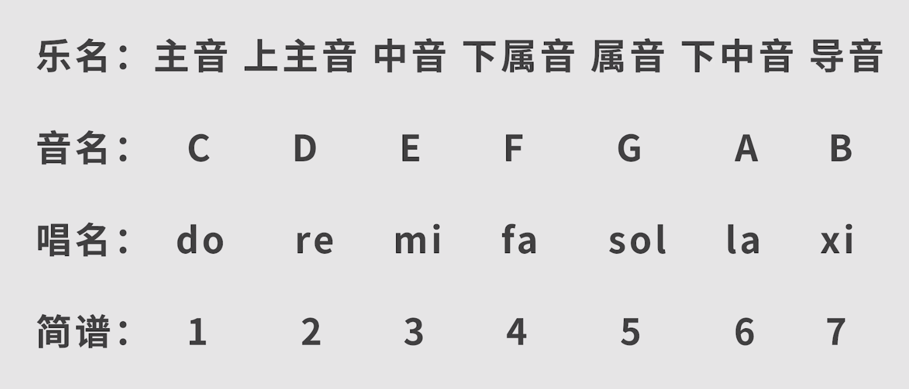

### 七和弦
- 七和弦是**四个音**按三度关系叠加的和弦
- 根音，三音，五音，七音
- 大七和弦：大三和弦+大三度
- 以C调式和弦为例：C D E F G A B

| 和弦种类   | 与三和弦关系    | 音程                 | 音名        | 记法  |     |
| ---------- | --------------- | -------------------- | ----------- | ----- | --- |
| 大七和弦   | 大三和弦+大三度 | 大三度 小三度 大三度 | C E G B     | Cmaj7 |     |
| 大小七和弦 | 大三和弦+小三度 | 大三度 小三度 小三度 | C E G bB    | C7    |     |
| 小七和弦   | 小三和弦+小三度 | 小三度 大三度 小三度 | C bE G bB   | Cmin7 |     |
| 小大七和弦 | 小三和弦+大三度 | 小三度 大三度 大三度 | C bE G B    | CnM7  |     |
| 减七和弦   | 减三和弦+小三度 | 小三度 小三度 小三度 | C bE bG bbB | Cdim7 |     |
| 半减七和弦 | 减三和弦+大三度 | 小三度 小三度 大三度 | C bE bG bB  | Cm7-5      |     |
- 减七和弦中7音为bbB不能是A，bG与A无法构成三度关系
- 半减七和弦与小七和弦非常相似，仅为5音降半音差别
- 流行歌曲常用七和弦为前三种
- 属七和弦：由属音充当根音的大小七和弦
	- C7在F调中就是属七和弦
	- C调中G7就是属七和弦 
	- 每个调只有一个属音，所以也只有一个属七和弦，其他的为大小七和弦
	- 一个调式中，出了属七和弦，其他大小七和弦都有离调音（7音）

### 九和弦
- 九和弦是五个音按三度关系叠加的和弦

| 大九和弦     | 大七和弦+小三度   | C E G B D   | Cmaj9 |
| ------------ | ----------------- | ----------- | ----- |
| 小九和弦     | 小七和弦+大三度   | C bE G bB D | Cm9   |
| 属九和弦     | 属七和弦+大三度   | C E G bB D  | C9    |
| 属七降九和弦 | 属九和弦9音降半音 | C E G bB bD | C7b9  |
| ADD9和弦     | 三和弦+9音        | C E G  D    | Cadd9 |
- 属九和弦中的5音不是离调音
- ADD9和弦相当于省略了

